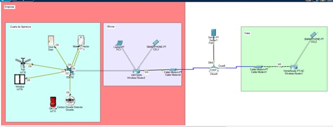
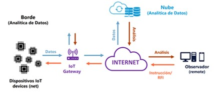
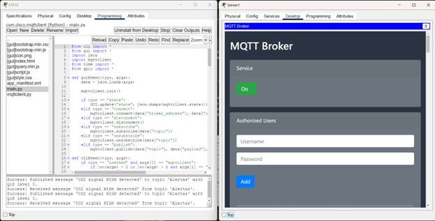
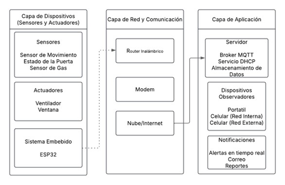
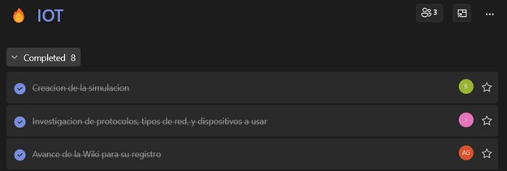

# Wiki Reinforcement Activity 2.2 IoT

## Estructura de la documentación

1. [Design Overview](#design-overview)
    1. [Sensores](#sensores)
    2. [Actuadores](#actuadores)
    3. [Sistema embebido](#sistema-embebido)
    4. [Servidor](#servidor)
    5. [Observadores](#observadores)
    6. [Dispositivos de red](#dispositivos-de-red)
2. [Conectividad del diseño](#conectividad-del-diseño)
    1. [Tipo de Red](#tipo-de-red)
    2. [Protocolos utilizados](#protocolos-utilizados)
    3. [Arquitectura del Sistema](#arquitectura-del-sistema)
3. [Validation Process](#validation-process)
4. [Retos presentados](#retos-presentados)
5. [Acta de trabajo](#acta-de-trabajo)
6. [Supporting References](#supporting-references)

---

## Design Overview

    

### Sensores 

* **Sensor de movimiento:** Se usa para detectar la caída de algún químico.
* **Estado de la puerta:** Con este sabemos si la puerta está abierta o cerrada. Cuando está cerrada indica que no hay ninguna persona adentro habilitando el sensor de movimiento para detectar cualquier caída. Y cuando está abierta desactiva el sensor de movimiento para evitar falsos positivos.
* **Sensor de gas:** Se usa un sensor de gas para detectar algún nivel alto de contaminación en el ambiente. Este envía una alerta al mensaje al ESP32 el cual activa los actuadores y publica un evento en el MQTT.

### Actuadores

* **Ventilador:** Se activa para hacer circular el aire.
* **Ventana:** Se activa para liberar hacia el exterior el aire contaminado.

### Sistema embebido
* **SBC Board:** Esta simula el ESP32, manejando la información recibida por los sensores, activando los actuadores y enviando los mensajes al MQTT. 

### Servidor

* El servidor cuenta con el servicio DHCP y MQTT, este dando IPs a los dispositivos conectados a la red y hosteando el MQTT bróker donde se guarda la información.

### Observadores
* **Portátil:** Un portátil dentro de la de la empresa con acceso de MQTT Client.
* **Celulares:** Uno de estos dentro de la red de la empresa y otro por fuera simulando el acceso como MQTT Client desde otra red Diferente.

### Dispositivos de red

* Diferentes dispositivos usados para lograr la correcta comunicación entre toda la red simulada.

---

## Conectividad del diseño

La conectividad encontrada en el diseño entre los dispositivos es de los siguientes tipos:

* **WiFi.** Utilizado para la conexión del ESP32 al Wireless router, y de los Wireless routers a otros dispositivos receptores.
* **Cable Co-axial.** Utilizados para las conexiones a la cloud desde los módems.
* **Cable Ethernet.** Destinado a las conexiones entre el router y el modem, así como para conectar la “nube” al servidor central.
* **Conexión con actores y sensores.** El tipo de conexión varia según el dispositivo, y así mismo los dispositivos presentes en el Packet Tracer ejemplifican el funcionamiento, por lo que pueden presentar cambios menores, como el tipo, marca o capacidad.

### Tipo de Red

El tipo de red usado es un WLAN dentro de la empresa, esta facilita la comunicación y envió de datos dentro de la misma red y su exposición a internet, dando un camino accesible a hasta el servidor.

    

---

### Protocolos utilizados

Tomando en cuenta el diseño creado en Packet Tracer reconocimos los diferentes tipos de protocolos a utilizar, siendo estos los siguientes:

* **IEEE 802.11.** Aprovechando las características WiFi con las que cuenta el ESP32, utilizamos este protocolo para que el microcontrolador se conecte al Wireless Router y de esta forma se realice la transferencia de la información requerida. Estas cualidades las maneja la librería de Espressif para WiFi [1].
* **SMTP.** Este protocolo es conocido popularmente como el protocolo encargado de los correos electrónicos [2]. Este se utilizará para enviar alertas o notificaciones acerca del estado del cuarto de químicos a los encargados de seguridad y gestión de la bodega. Este no se encuentra implementado debido a la complejidad de su implementación dentro de Cisco Packet Tracer
* **MQTT / TCP / TLS/SSL.** MQTT Version 5.0 es un protocolo OASIS de mensajería basado en el TCP/IP basado en un modelo de publicador-suscriptor [3], este funciona en conjunto con el bróker alojado en un servidor para ayudar en la toma de decisiones en el funcionamiento mismo del sistema en su totalidad. Este se ejecutará sobre el protocolo TCP (puerto 1883) o el protocolo TLS/SSL (puerto 8883)

    

* **DHCP.** Se usa este protocolo de red desde el servidor principal para dar IPs a los dispositivos y que puedan acceder al MQTT.

---

### Arquitectura del Sistema

El sistema IOT planteado está estructurado en tres capas principales que facilitan su funcionamiento y comunicación. La capa de dispositivos contiene los sensores y actuadores encargados de recopilar información y ejecutar acciones. La capa de red y comunicación permite la transmisión de datos entre los diferentes dispositivos y el servidor a través de los distintos protocolos que se mencionaron anteriormente. Finalmente, en la capa de aplicación permite procesar la información, gestionar las alertas y la supervisión remota. 

    

---

## Validation Process

Para ver un funcionamiento más explícito se recomienda ver el video. En este se explica de mejor manera porque el uso de dispositivos como el detector de dióxido de carbono o el old car.

---

## Retos presentados

Uno de los retos presentados fue la integración efectiva de los protocolos de comunicación en este sistema IOT. Fue necesario diseñar una red que permitiera la comunicación entre dispositivos con diferentes estándares, usando mecanismos de traducción y sincronización. Además, se configuraron canales seguros con TCP y TLS/SSL, se gestionaron los puertos de comunicación (1883 y 8883) y se implementó un adaptador de comunicación para facilitar el intercambio de datos entre el ESP32, los sensores y los sistemas de gestión.

Por otro lado, establecer un sistema de comunicación confiable y en tiempo real también representó un reto. Se implementó un sistema basado en el protocolo MQTT que permite la publicación y suscripción de eventos instantáneos. Este protocolo actúa como un centro de distribución de mensajes, garantizando que cada dispositivo autorizado reciba alertas de manera inmediata. Se desarrolló además un protocolo de confirmación que permite rastrear la recepción y lectura de cada notificación, agregando una capa adicional de confiabilidad al sistema de comunicaciones. 

Uno de los objetivos a lograr era la automatización de envió de alertas al MQTT, esto siendo un reto ya que fue necesario editar el código fuente guardo dentro del dispositivo para poder programar este handler.

---

## Acta de trabajo

A continuación, se presenta el acta de trabajo, detallando las contribuciones de cada miembro en la elaboración del proyecto. Cabe destacar que todos colaboramos mutuamente para garantizar un desarrollo preciso y efectivo del trabajo.

    

---

## Supporting References

[1] “Wi-Fi - ESP32 - — ESP-IDF Programming Guide latest documentation”. Technical Documents | Espressif Systems. Accedido el 28 de marzo de 2025. [En línea]. Disponible: https://docs.espressif.com/projects/esp-idf/en/latest/esp32/api-reference/network/esp_wifi.html

[2] “IBM i 7.3”. IBM - United States. Accedido el 28 de marzo de 2025. [En línea]. Disponible: https://www.ibm.com/docs/es/i/7.3?topic=information-smtp

[3] “MQTT Version 5.0”. Index of /. Accedido el 28 de marzo de 2025. [En línea]. Disponible: https://docs.oasis-open.org/mqtt/mqtt/v5.0/mqtt-v5.0.html

